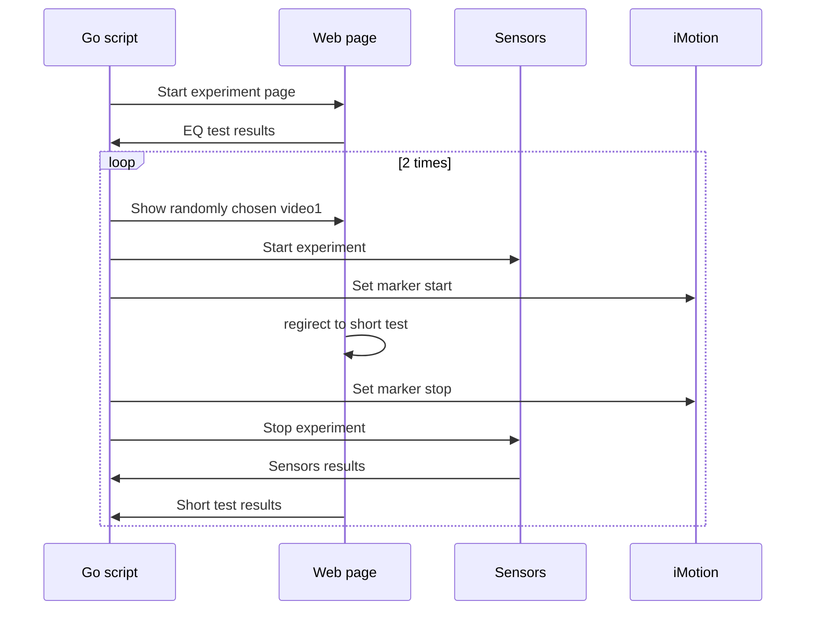

# Experiment runner for master thesis

This repo is made to run experiment for my thesis. It controls NeuLog sensors (GSR, Pulse) and iMotions program.

## To start the experiment

1. Download zip of this repo.
2. Run go/m.exe (only Windows supported)
3. Open http://localhost:8090 in incognito window
4. To cunduct the experiment [follow the checklist](https://github.com/kiote/empathy/blob/master/experimentChecklist.md)

## To calculate empathy score

Copy eq.csv file from corresponding folder to project root, rename it to `parse.csv` and run 

```
npm i
npm start
```

## What is happening here



## Data collected

can be found here: https://drive.google.com/drive/u/1/folders/1c6p4stA_JGAvgFlM5DCyMnXjyYI_Pilj (if for some reason you need an access please mention why)
