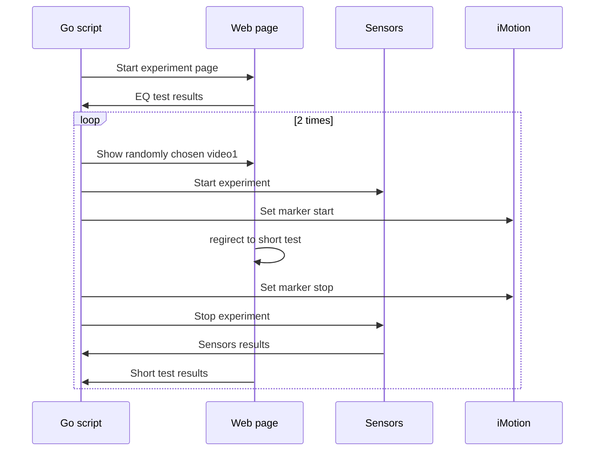

# Experiment runner for master thesis

This repo is made to run experiment for my thesis. It controls NeuLog sensors (GSR, Pulse) and iMotions program.

## To start the experiment

```
git clone git@github.com:kiote/empathy.git
cd empathy/go
go run .
```

open http://localhost:8090

## To calculate empathy score

Copy eq.csv file from corresponding folder to project root, rename it to `parse.csv` and run 

```
npm i
npm start
```

## What is happening here


